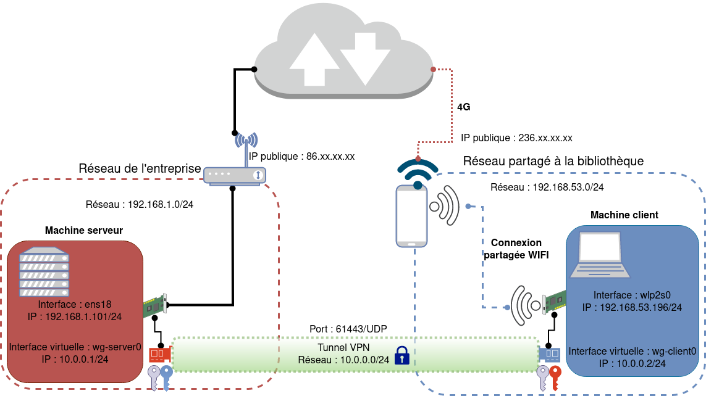

# WireGuard_Install                                          
## Rôle                                          
Ce script permet d'installer le serveur VPN WireGuard et de créé automatiquement une configuration valide du serveur.
Il permet aussi de créer huit configurations basiques de clients peer-1, peer-2...peer-9.
Il installe un serveur DNS (Dnsmasq) pour la résolution de nom en local à partir du VPN.

## Schéma réseau


## Les données automatiquement récupérées
1. Adresse IP publique, ex : 86.**.**.** 
2. Adresse du réseau local, ex : 192.168.1.0/24
3. Adresse de la passerelle du réseau local, ex : 192.168.1.1

## Les données fixes
1. Adresse IP de l'interface VPN, ex : 10.0.0.1/24
2. Adresse réseau du VPN, ex : 10.0.0.0/24
3. Les ports DNS, SSH, WireGuard, ex : 53, 22, 61443
4. Adresses IP des clients, ex : 10.0.0.2...10.0.0.9
5. L'extension des noms est [nom].lan

# Limites
* Il ne vérifie pas si le réseau VPN est différent du réseau local
* Le script peut être lancé qu'une seule fois, certaines parties sont non reproductible

## Usage
./wireguard_install.sh

## Quelques indications
Compléter la liste des noms DNS des machines locales dans le fichier /etc/hosts
puis appliquer les modifications avec la commande : sudo systemctl restart dnsmasq.

8 clients ont été créés automatiquement, peer-2, peer-3...peer-9
Les fichiers de configuration et les QR codes des clients se trouvent dans : /etc/wireguard/clients/peer-[N]
```bash
root@debcli:~# tree -L 2 /etc/wireguard/
/etc/wireguard/
├── clients
│   ├── peer-2
│   ├── peer-3
│   ├── peer-4
│   ├── peer-5
│   ├── peer-6
│   ├── peer-7
│   ├── peer-8
│   └── peer-9
├── wg-server.conf
├── wg-server-private.key
└── wg-server-public.key

10 directories, 3 files
root@debcli:~# tree /etc/wireguard/clients/peer-2/
/etc/wireguard/clients/peer-2/
├── peer-2.conf
├── qr-peer-2.png
├── wg-peer-2-private.key
└── wg-peer-2-public.key

1 directory, 4 files
root@debcli:~# 
```
Pour envoyer les configurations aux machines clientes utiliser :
* sous Linux utiliser la commande : sudo scp -r /etc/wireguard/clients/peer-[N] [USER]@[IP]:/home/[USER]
* sous Windows utiliser WinSCP.
* sur un smartphone afficher le QR code avec la commande : sudo qrencode --type=ansiutf8 --read-from=/etc/wireguard/clients/peer-[N]/peer-[N].conf
